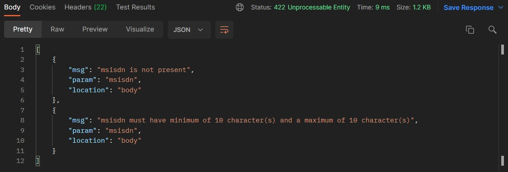
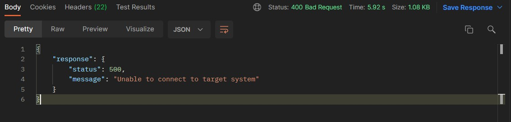
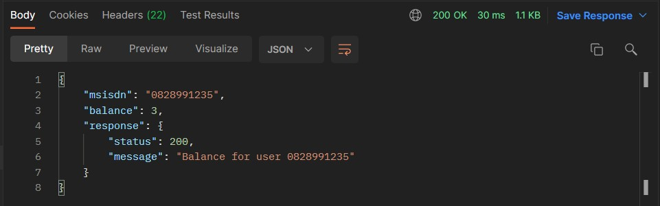

<h1 align="center">NodeJs Express Game Application</h1>

## Features 

* **API service** intergrating with an **XML service** intergrating.
* **Express.js**
* JWT Token security - token validation and generation of token.
* Input validation with Express validator. 
* **Axios** to integrate with XML service. 
* Error handling. 
* Logging of HTTP calls. 
* Response models.
* Using Babel to use the latest import syntax. 

## How to use and test this NodeJs Express application

1. Clone this repository.
2. Head to https://github.com/nvm-sh/nvm and follow the installation instructions.
3. Once nvm is installed, install the following version of nodejs using the following command 'nvm install 16.13.0'
4. Run the following command to use the following version: 'nvm use 16.13.0 lts'
5. Run the following command to start the application.: 'npm start'
6. Import the Postman collection into your Postman application (or API service of your choice) using the following link: https://www.getpostman.com/collections/16eaea102665bca607ce 
7. Generate a token. (You can change the token expiration time in the .env file)
8. Call one of the three services that you would like to test. 

  

## JWT Authentication

  

  

## API Input Validation

  

## XML Intergration invalid response

  

## XML Intergration valid response

  

## ToDo / Improvement list

1. Swagger 
2. Jest validation
3. Docker Container
4. PM2 for load balancing
5. Load testing 

