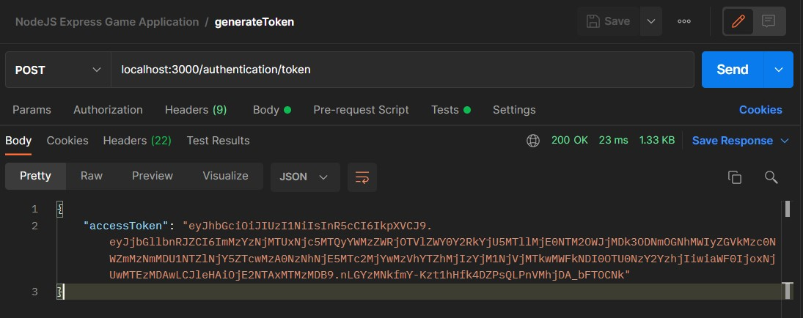
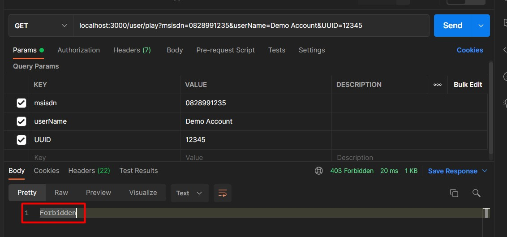

  <h1>NodeJs Express Game Application</h1>

**Features**:
* **API service** intergrating with a **XML** service intergrating
* Using **express.js**
* JWT Token security - token validation and generation of token
* Input Validation with express validator 
* **Axios** to integrate with xml service 
* Error Handling 
* Logging of http calls 
* Response Models
* Using Babel to use the Latest import syntax 

## How to use and test this NodeJs Express application

1.Clone this repository
2.Head to https://github.com/nvm-sh/nvm and follow the installation instructions
3.Once nvm is installed, install the following version of nodejs using the following command 'nvm install 16.13.0'
4.Then run the following command to use the following version 'nvm use 16.13.0 lts'
5.Then run the 'npm start' to start the application
6.Then import the post man collection to your post man application (or API service you use)
7.Then generate the token
8.Then call the service you would like to test

## JWT Authentication

  

  

